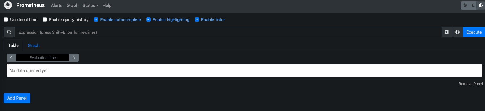

This is a test to deploy Grafana and Promethues with Terragrunt + Helm + Terraform.

Structure
```sh
grafana-prometheus-deploy/
├── terragrunt.hcl                  # 共用設定 (如 backend)
├── modules/
│   └── monitoring/
│       ├── main.tf                 # Helm 安裝 Grafana & Prometheus
│       └── values/
│           ├── grafana-values.yaml
│           └── prometheus-values.yaml
├── local/
│   └── monitoring/
│       └── terragrunt.hcl
├── dev/
│   └── monitoring/
│       └── terragrunt.hcl         # dev 環境參數
└── prod/
    └── monitoring/
        └── terragrunt.hcl         # prod 環境參數
```

## Deployment
```sh
cd local/monitoring
terragrunt init
terragrunt apply
```

## Access in browswer
Promethues: http://localhost:32001


 

Grafana: http://localhost:32000/login



## Default Grafana Account:
- Username: `admin`
- Password: look up in **grafana-values.yaml**

## Clean up deployment
```sh
terragrunt destroy
```