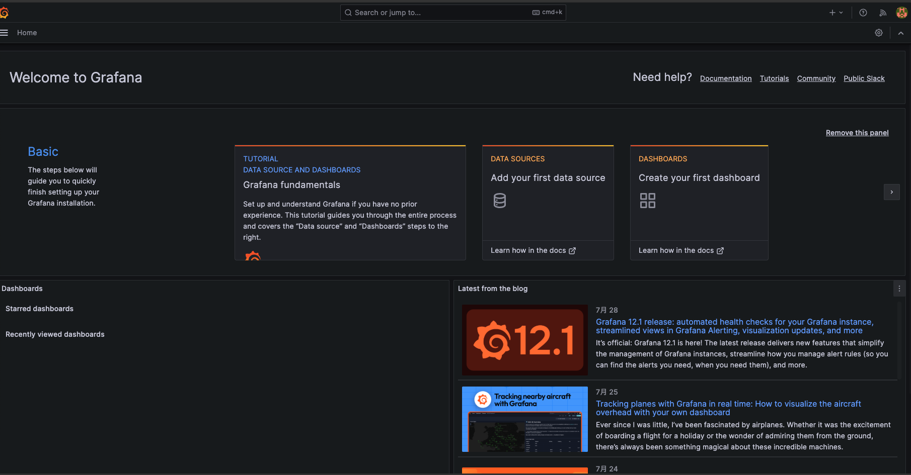

## Deployment
```sh
cd local/monitoring
terragrunt init
terragrunt apply
```

## Access in browswer
Promethues: http://localhost:32001


 

Grafana: http://localhost:32000/login


## Default Grafana Account:
- Username: `admin`
- Password: look up in **grafana-values.yaml**

## Clean up deployment
```sh
terragrunt destroy
```